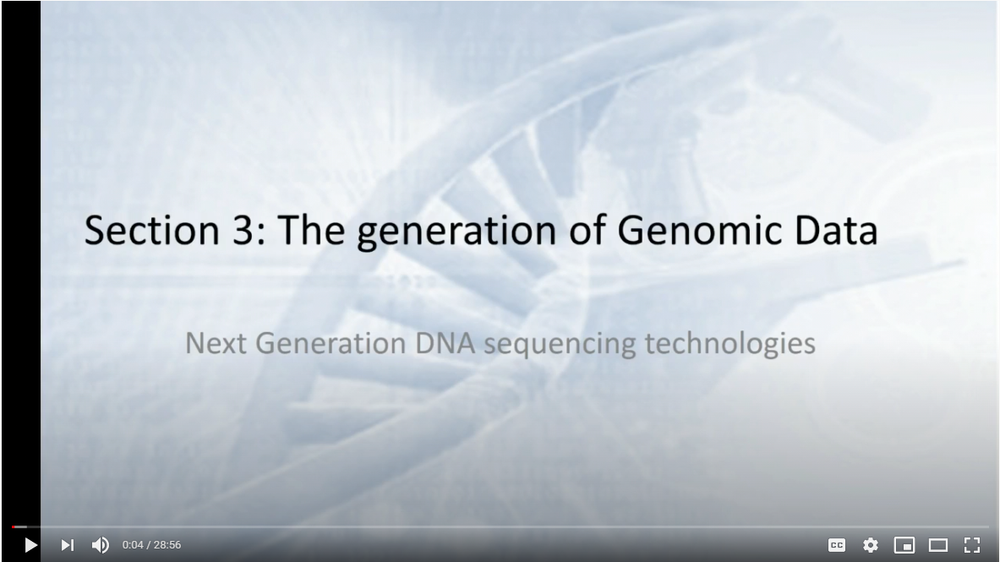

# Overview - 16S Metabarcoding with Qiime 2
In this tutorial we'll go over how to use QIIME 2 to analyze metabarcoding data. We'll start with an introduction about how metabarcoding (aka amplicon) data is produced and with a refresher for working in the BASH command-line environment. 

## Some definitions

<ins>DNA taxonomy</ins> in a broad sense, means any form of analysis that uses variation in DNA sequence data to inform species delimitation. 

<ins>Barcoding</ins> - identification (taxonomically/phylogenetically) of an organism by a short section of DNA/RNA, usually through PCR amplification with conserved DNA/RNA primers.

<ins>Polymerase chain reaction (PCR)</ins> - an amplification technique for cloning the specific or targeted parts of a DNA sequence to generate thousands to millions of copies of DNA of interest.

<ins>Metabarcoding</ins> - barcoding of DNA/RNA or eDNA/eRNA in a manner that allows for identification of many taxa within the same sample.  

<ins>Metagenomics</ins> -  *en mass* sequencing of a community of organisms using whole-genome shotgun sequencing   


<br />

Collect Sample            |  Extract DNA
:-------------------------:|:-------------------------:
|  

PCR Amplification          |  Repeat for x Cycles
:-------------------------:|:-------------------------:
 | 


Prepare Library           |  Sequence DNA
:-------------------------:|:-------------------------:
  |  

<br />
<br />

  ## How NGS sequencing works
[](https://www.youtube.com/watch?v=p4vKJJlNTKA&t=9s "Sequencing")  
<br />
<br />

<ins>Selecing a locus for barcoding</ins>

1. The targeted region should have little intraspecific variation (< 2% sequence identity) and enough interspecific variation (>2% sequence identity) to distinguish different species.

2. It should be phylogenetically informative to allow the placement of newly barcoded organisms to accurate lineages. 

3. The primer binding sites should be highly conserved and specific, so DNA amplification is reliable across all taxa in question. This is especially important for en mass community analyses (metabarcoding) and will make the development of universal primers more efficient and help alleviate potential PCR bias. 

4. For studies utilizing HTS the target region must be small enough to be recovered on one or two sequencing reads when using paired-end information (<600 bps). Shorter sequences are also preferred for recovering barcoding sequences from preserved or degraded samples.  

5. Reference sequence databases with taxonomic information exist for the region in question.


## Common primers used at HCGS
| Target-Organisms      | Gene | Region    | Location/Name | Length (bp)      | Forward-primer         | Reverse-primer              | F_length | R_length | Reference                  |
| --------------------- | ---- | --------- | ------------- | ---------------- | ---------------------- | --------------------------- | -------- | -------- | -------------------------- |
| Prokaryotes           | 16S  | V4        | 515F-806R     | ~390             | GTGYCAGCMGCCGCGGTAA    | GGACTACNVGGGTWTCTAAT        | 19       | 20       | Walters et al. 2016        |
| Prokaryotes           | 16S  | V4-V5     | 515-926R      | ~510             | GTGYCAGCMGCCGCGGTAA    | CCGYCAATTYMTTTRAGTTT        | 19       | 20       | Stoek et al. 2010          |
| Microbial Eukaryotes  | 18S  | V9        | 1391F-1510R   | ~210 - 310       | GTACACACCGCCCGTC       | TGATCCTTCTGCAGGTTCACCTAC    | 16       | 24       | Amaral-Zettler et al. 2009 |
| Fungal and micro euks | ITS  | ITS1-ITS2 | ITS1F-ITS2    | ~250 - 600       | CTTGGTCATTTAGAGGAAGTAA | GCTGCGTTCTTCATCGATGC        | 22       | 20       | White et al., 1990         |
| Fish                  | 12S  | V5        | MiFish        | ~163 - 185       | GTCGGTAAAACTCGTGCCAGC  | CATAGTGGGGTATCTAATCCCAGTTTG | 21       | 27       | Miya et al, 2015           |

<br />
<br />

## General Notes:
**For each program that we run in this tutorial I have provided a link to the manual**. These manuals provide a thorough explanation of what exactly we are doing. Before running the workflow on your own data you should read the manual/publication for the program.

Throughout this tutorial the commands you will type are formatted into the gray text boxes (don't do it when learning but they can be faithfully copied and pasted). The '#' symbol indicates a comment, BASH knows to ignore these lines. 

This tutorial assumes a general understanding of the BASH environment. **You should be familiar with moving around the directories and understand how to manipulate files**.


**Remember to tab complete!** There is a reason the tab is my favorite key. It prevents spelling errors and allows you to work much faster. Remember if a filename isn't auto-completing you can hit tab twice to see your files while you continue typing your command. If a file doesn't auto-complete it means you either have a spelling mistake, are in a different directory than you originally thought, or that it doesn't exist.

<br />

# Let's Begin!

## Connect to the server
See the BASH tutorials to get started.

[BASH Tutorials](https://github.com/Joseph7e/HCGS-BASH-tutorial)

[INBRE BASH Tutorials](https://geiselmed.dartmouth.edu/nhinbre/bioinformatics-modules/)  

## Activate the genomics environment
This is important and ensures that all the programs we use are updated and in working order. You'll need to do this every time you login to the server and need general bioinformatic tools.

```
conda activate genomics

conda info --envs
```

## BASH practice

```
# setup working directory
mkdir ~/bash-practice
cd ~/bash-practice

# copy example reads
cp -r /home/share/examples/example-reads/ ./

```

[Link explaining the 'Read Name Format'](http://support.illumina.com/content/dam/illumina-support/help/BaseSpaceHelp_v2/Content/Vault/Informatics/Sequencing_Analysis/BS/swSEQ_mBS_FASTQFiles.htm): SampleName_Barcode_LaneNumber_001.fastq.gz


## Sequencing Read Assessment

Note the file extension - fastq.**gz**. Since these files are usually pretty big it is standard to receive them compressed. To view these files ourselves (which you normally wouldn't do) you either have to decompress the data with gunzip or by using variations of the typical commands. Instead of 'cat' we use 'zcat', instead of grep we can use 'zgrep'. Or just use less which allows you to stream a zipped file for viewing.
       
```bash
less -S example-reads/*_R1_*
```

#### Fastq File Format
Each sequencing read entry is four lines long.. 

    - Line 1. Always begins with an '@' symbol and denotes the header. This is unique to each sequence and has info about the sequencing run. 

    - Line 2. The actual sequencing read for your organism, a 250 bp string of As, Ts, Cs, and Gs.

    - Line 3. Begins with a '+' symbol, this is the header for the read quality. Usually the same as the first line header. 

    - Line 4. Next are ascii symbols representing the quality score (see table below) for each base in your sequence. This denotes how confident we are in the base call for each respective nucleotide. This line is the same length as the sequencing line since we have a quality score for each and every base of the sequence. 


* Count The Number of Raw Reads

I always start by counting the number of reads I have for each sample. This is done to quickly assess whether we have enough data to assemble a meaningful genome. Usually these file contains millions of reads, good thing BASH is great for parsing large files! Note that the forward and reverse reads will have the same number of entries so you only need to count one.

```bash
# using grep. Note that I don't count just '@', this is because that symbol may appear in the quality lines.
zgrep -c '^@' Sample*/*R1*
# counting the lines and dividing by 4. Remember each read entry is exactly four lines long. These numbers should match.
zcat Sample*/*_R1_* | wc -l
```
* Whats our total bp of data? This is what we call our sequencing throughput. We multiple the number of reads by the read length (ours is 250) and by 2 because it is paired-end data.

(Read length x 2(paired-end) x Number of reads)

```
# we can do this calculation from the terminal with echo and bc (bc is the terminal calculator)
echo "Number_of_reads * 250 * 2" | bc
```

## Examine Read Quality
program: FASTQC  
manual: https://www.bioinformatics.babraham.ac.uk/projects/fastqc/

[FASTQC explained](http://www.bioinformatics.babraham.ac.uk/projects/fastqc/Help/3%20Analysis%20Modules/)

* Run Fastqc

FastQC is a program to summarize read qualities and base composition. Since we have millions of reads there is no practical way to do this by hand. We call the program to parse through the fastq files and do the hard work for us. **The input to the program is one or more fastq file(s) and the output is an html file with several figures.** The link above describes what each of the output figures are describing. I mainly focus on the first graph which visualizes our average read qualities and the last figure which shows the adapter content. Note that this program does not do anything to your data, as with the majority of the assessment tools, it merely reads it.

```bash
# make a directory to store the output
mkdir fastqc_raw-reads
# run the program
fastqc example-reads*/*_R1_* example-reads*/*_R2_* -o fastqc_raw-reads
ls fastqc_raw-reads
# the resulting folder should contain a zipped archive and an html file, we can ignore the zipped archive which is redundant.
```

* Transfer resulting HTML files to computer using filezilla or with the command line on OSX/Linux.

On filezilla you will need to enter the same server information when you login form the terminal. Be sure to use port 22.  

```bash
# to get the absolute path to a file you can use the ‘readlink’ command.
readlink -f fastqc_raw-reads/*.html
# copy those paths, we will use them for the file transfer
# In a fresh terminal on OSX, Linux, or BASH for windows
scp USERNAME@ron.sr.unh.edu:/home/GROUP/USERNAME/mdibl-t3-2019-WGS/fastqc_raw-reads/*.html /path/to/put/files
```

* Transfer resulting HTML files to computer using filezilla or with the command line on OSX/Linux.

On filezilla you will need to enter the same server information when you login form the terminal. Be sure to use port 22.  

```bash
# to get the absolute path to a file you can use the ‘readlink’ command.
readlink -f fastqc_raw-reads/*.html
# copy those paths, we will use them for the file transfer
# In a fresh terminal on OSX, Linux, or BASH for windows
scp USERNAME@ron.sr.unh.edu:/home/GROUP/USERNAME/bash-practice/fastqc_raw-reads/*.html /path/to/put/files
```


## Qiime2 documentation


"QIIME 2™ is a next-generation microbiome bioinformatics platform that is extensible, free, open source, and community developed."

[Qiime2 user documentation](https://docs.qiime2.org/2022.2/)

[Qiime2 visuals](https://view.qiime2.org/)

[Moving Pictures Tutorial](https://docs.qiime2.org/2022.2/tutorials/moving-pictures/)

[Getting Oriented](https://docs.qiime2.org/2022.2/tutorials/overview/#let-s-get-oriented-flowcharts)

[Metadata file](https://docs.google.com/spreadsheets/d/1ZiRFItD26vgetcQQft41yiZgTJULstbdYrcprlgLws0/edit?usp=sharing)


## Example Data

These data are from set of mouse fecal samples provided by [Jason Bubier from The Jackson Laboratory](https://www.jax.org/research-and-faculty/faculty/research-scientists/jason-bubier).
The samples were run targeting the V1-V3 region of the 16S gene using the 27F - 534R primer pair on an Illumnina MiSeq on a paired end 300 bp run.

### Primers
~~~
27F [20 bp]
 5'AGM GTT YGA TYM YGG CTC AG
534R [17 bp]
 5'ATT ACC GCG GCT GCT GG
~~~
For Metadata we have the sex, strain, age in days.
Our goal is to examine the correlation of the fecal microbiome we observe with these metadata.
We will primarily use the [Qiime 2](https://qiime2.org/) bioinformatics platform.
Qiime 2 is free and open source and available from Linux and OSX.
We will use the Qiime2 command line interface, there is also the ["Artifact" python API](https://docs.qiime2.org/2019.4/interfaces/artifact-api/) which can be more powerful.


### Copy starting data
~~~bash
mkdir hcgs-qiime2-workshop
cd hcgs-qiime2-workshop
cp /home/share/examples/cocaine_mouse/* .
ls

# mdat.tsv

less -S mdat.tsv
#SampleID       Sex     Treatment       Strain  Date    PrePost Dataset HaveBred        PerformedPCR    Description     pptreatment     Testing
#q2:types       categorical     categorical     categorical     numeric categorical     categorical     categorical     categorical             categorical     categorical
JBCDJ00OLJ1STT0B00000191821C7M7FGT1904904       F       Sham    CC004   0       Pre     Dataset1                Jax     19182_1 PreSham Train
JBCDJ00OLK1STT0B00000191671C7M7FGT1904905       F       Coc     CC041   0       Pre     Dataset1                Jax     19167_1 PreCoc  Train
JBCDJ00OLL1STT0B00000191771C7M7FGT1904906       M       Sham    CC004   0       Pre     Dataset1                Jax     19177_1 PreSham Test
JBCDJ00OLM1STT0B00000191861C7M7FGT1904907       M       Coc     CC004   0       Pre     Dataset1                Jax     19186_1 PreCoc  Test
JBCDJ00OLN1STT0B00000191791C7M7FGT1904908       F       Coc     CC004   0       Pre     Dataset1                Jax     19179_1 PreCoc  Train
JBCDJ00OLO1STT0B00000191691C7M7FGT1904909       F       Sham    CC041   0       Pre     Dataset1                Jax     19169_1 PreSham Test
JBCDJ00OLP1STT0B00000191731C7M7FGT1904910       M       Coc     CC041   0       Pre     Dataset1                Jax     19173_1 PreCoc  Test
JBCDJ00OLQ1STT0B00000191641C7M7FGT1904911       M       Coc     CC041   0       Pre     Dataset1                Jax     19164_1 PreCoc  Train
JBCDJ00OLR1STT0B00000191801C7M7FGT1904912       F       Sham    CC004   0       Pre     Dataset1                Jax     19180_1 PreSham Train
JBCDJ00OLS1STT0B00000191831C7M7FGT1904913       F       Coc     CC004   0       Pre     Dataset1                Jax     19183_1 PreCoc  Train
JBCDJ00OLT1STT0B00000191841C7M7FGT1904914       M       Sham    CC004   0       Pre     Dataset1                Jax     19184_1 PreSham Train
JBCDJ00OLU1STT0B00000191711C7M7FGT1904915       M       Coc     CC041   0       Pre     Dataset1                Jax     19171_1 PreCoc  Train
JBCDJ00OLV1STT0B00000191681C7M7FGT1904916       F       Sham    CC041   0       Pre     Dataset1                Jax     19168_1 PreSham Train

~~~
When we look at the metadata file we see the metadata that we will be able to use during our analysis

